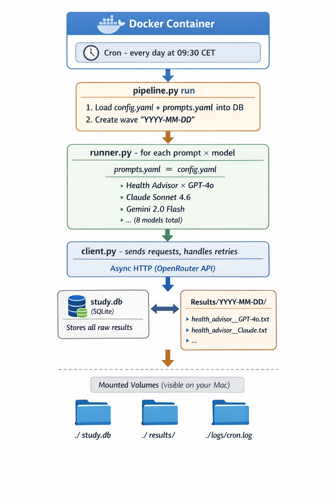

# LLM Study

A pipeline that automatically sends prompts to multiple LLM models daily and collects their responses for longitudinal analysis.

## How it works




Every day at **09:30 CET**, a Docker container sends all prompts from `prompts.yaml` to every model configured in `config.yaml`. Responses are stored in a SQLite database and exported as individual `.txt` files.

```
results/
  2026-03-04/
    health_advisor__GPT-4o.txt
    health_advisor__Claude_Sonnet_4.6.txt
    ...
```

## Project structure

```
llm_study/
├── config.yaml       # Models and study settings
├── prompts.yaml      # Prompts to send daily
├── pipeline.py       # CLI entry point
├── runner.py         # Async job execution
├── client.py         # OpenRouter API client
├── db.py             # SQLite database layer
├── analysis.py       # Statistics and export helpers
├── Dockerfile        # Container definition
├── docker-compose.yml
├── .env              # API key (never commit this)
├── study.db          # SQLite database (auto-created)
├── results/          # Daily TXT exports
└── logs/             # Cron logs
```

## Setup

**1. Add your API key to `.env`:**
```
OPENROUTER_API_KEY=sk-or-v1-...
```

**2. Edit your prompts in `prompts.yaml`:**
```yaml
prompts:
  - label: "my_prompt"
    category: "general"
    tags: ["example"]
    template: >
      Your prompt text here.
    version: 1
```

**3. Build and start the container:**
```bash
docker compose up --build -d
```

## Commands

| Command | Description |
|---|---|
| `docker compose up --build -d` | Build and start the container |
| `docker compose down` | Stop the container |
| `docker compose ps` | Check container status |
| `docker compose exec app python3 pipeline.py run` | Trigger a manual run |
| `docker compose exec app python3 pipeline.py report` | Print statistics |
| `docker compose exec app python3 pipeline.py export --format csv` | Export all data to CSV |
| `cat logs/cron.log` | Check cron job logs |

## Models

Configured in `config.yaml`. Currently querying:

- GPT-4o
- GPT-4o-mini
- Claude Sonnet 4.6
- Claude Haiku 4.5
- Gemini 2.0 Flash
- Llama 3.3 70B
- Mistral Large 2
- DeepSeek V3

## Output format

Each `.txt` file contains a metadata header and the model's response:

```
Date        : 2026-03-04
Model       : GPT-4o
Prompt      : health_advisor
Category    : personal
Tokens in   : 18
Tokens out  : 312
Latency ms  : 843
Finish      : stop
Error       : none

── Prompt ──────────────────────────────────────────────────────────
How can I improve my sleep quality?

── Response ────────────────────────────────────────────────────────
Here are evidence-based strategies...
```
